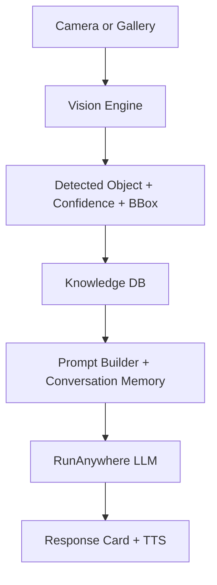
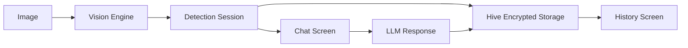
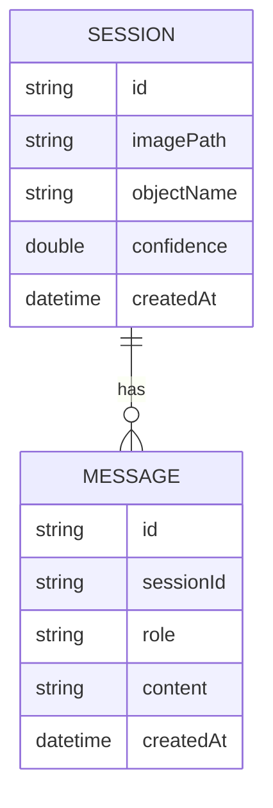

# OFFLINE SMART CAMERA AI ASSISTANT

Production-ready Flutter architecture for a fully offline camera assistant that runs on-device AI with RunAnywhere runtime after installation. The app is built with Clean Architecture, Riverpod, encrypted local storage, and model integrity checks.

## Status and build note
- This workspace does not have Flutter or Android SDK installed, so I could not build an APK here. The project code is complete and ready to build once Flutter is installed.
- Follow the Build and APK section below to produce a release APK on your machine.

## Core capabilities
- Camera capture and gallery upload
- Object detection with bounding boxes (pluggable vision engine)
- On-device LLM answers with conversational context
- Voice or text interaction
- Encrypted offline knowledge database and conversation history
- Model integrity verification

## Architecture
Clean Architecture layers:
- Presentation: Flutter UI + Riverpod state
- Domain: entities, repositories, use cases
- Data: local Hive data source (AES encrypted)
- AI: RunAnywhere LLM + ONNX STT, pluggable vision engine

### AI pipeline
1. Capture image
2. Vision model detects object
3. Knowledge DB enriches object
4. Prompt builder injects context
5. RunAnywhere LLM answers
6. TTS speaks response



### Data flow


### Conversation memory
Conversation is stored per detection session:
- Session: image path, detected object, confidence, timestamp
- Messages: user + assistant messages linked by session id



## Folder structure
```
offline_smart_camera_ai_assistant/
  assets/
    db/objects_seed.json
    models/README.md
  lib/
    ai/
      runanywhere_service.dart
      speech_service.dart
      vision_engine.dart
    core/
      app_providers.dart
      app_routes.dart
      app_theme.dart
      security/
        integrity_service.dart
        secure_key_service.dart
      storage/
        hive_store.dart
        model_storage.dart
      utils/
        image_utils.dart
    data/
      local_data_source.dart
      repositories_impl.dart
    domain/
      entities.dart
      repositories.dart
      usecases.dart
    features/
      camera_screen.dart
      chat_screen.dart
      history_screen.dart
      home_screen.dart
      result_screen.dart
      settings_screen.dart
      splash_screen.dart
      session_state.dart
    app.dart
    main.dart
  pubspec.yaml
  analysis_options.yaml
  README.md
```

## Security implementation
- Encrypted Hive boxes using AES-256 key stored in Flutter Secure Storage.
- Model integrity verification via SHA-256 checks before loading.
- Image input validation for file type and size.
- RunAnywhere executes models on-device to keep data local.

## Performance optimization
- Lazy model loading and download only when needed
- Image resizing before inference
- Background isolates for CPU-heavy preprocessing
- Model quantization by using small model variants
- In-memory cache for repeated detections

## RunAnywhere model integration
1. Set model URLs in `lib/ai/runanywhere_service.dart`.
2. Optionally set `localFileName` and `sha256` for integrity checks.
3. The app registers models at startup.
4. On first run, the app downloads models and stores them for offline use.
5. After download, inference runs offline on-device.

Use RunAnywhere model sizes appropriate for mid-range devices:
- Vision: YOLOv8 Nano or MobileNetV3 (pluggable in `vision_engine.dart`)
- LLM: TinyLlama or Gemma 2B quantized
- STT: Whisper Tiny (ONNX)

## Build and APK
1. Install Flutter and Android SDK.
2. From this folder:
   - `flutter pub get`
   - If `android/` and `ios/` folders are missing, run `flutter create .` once to generate platform scaffolding.
   - `flutter build apk --release`
3. APK output: `build/app/outputs/flutter-apk/app-release.apk`

## Permissions
Add camera and microphone permissions for Android and iOS once platform folders exist:
- Android: CAMERA, RECORD_AUDIO, and storage access if needed.
- iOS: NSCameraUsageDescription and NSMicrophoneUsageDescription.

## Notes on RunAnywhere support
- RunAnywhere Flutter SDK is used for LLM and STT per the official Flutter docs.
- RunAnywhere Flutter VLM/vision is not publicly documented yet; the vision engine is pluggable and ready to swap when available.

## Offline model files
Model files are not bundled here. See [assets/models/README.md](/d:/Coding_Agent_Offline/offline_smart_camera_ai_assistant/assets/models/README.md).
